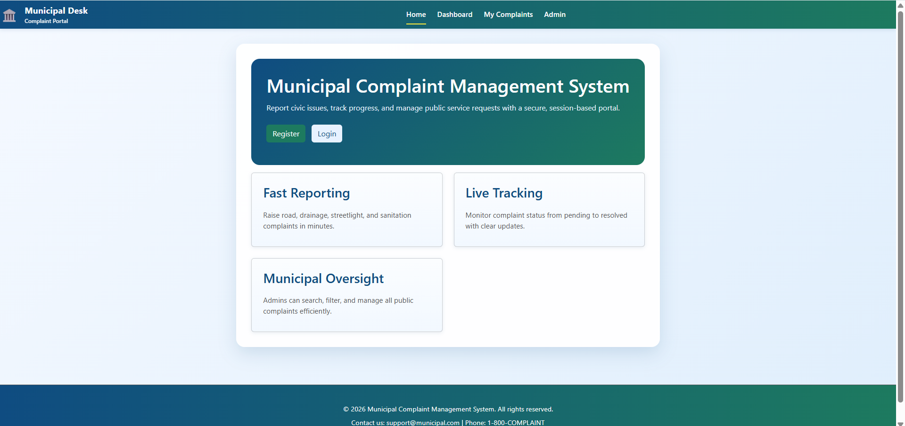
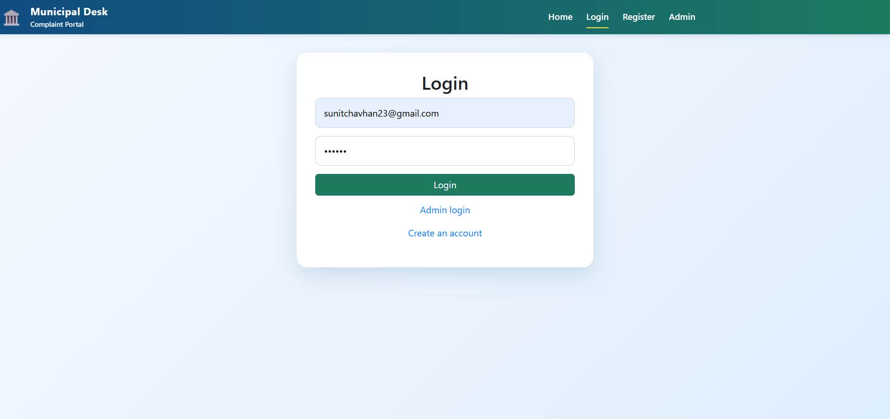
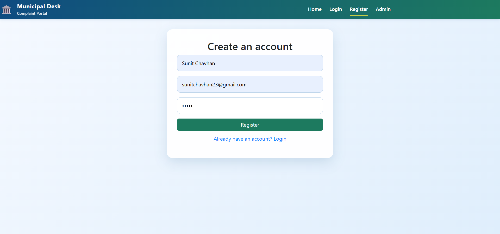
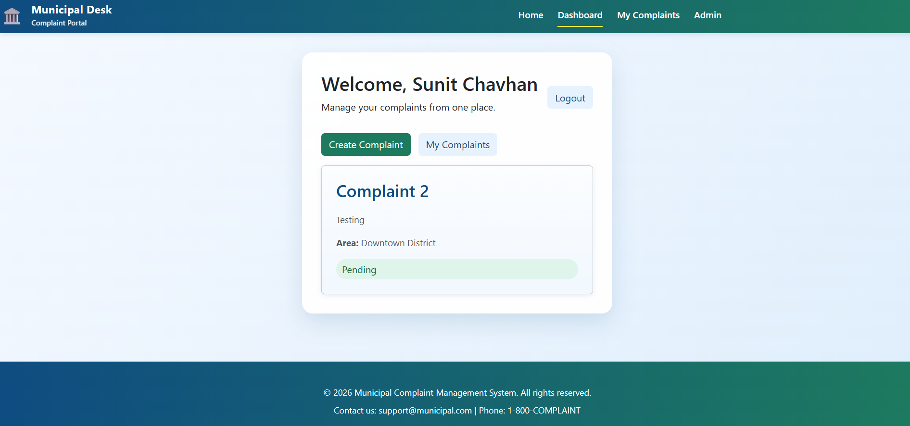
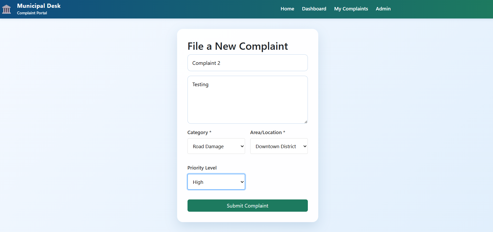
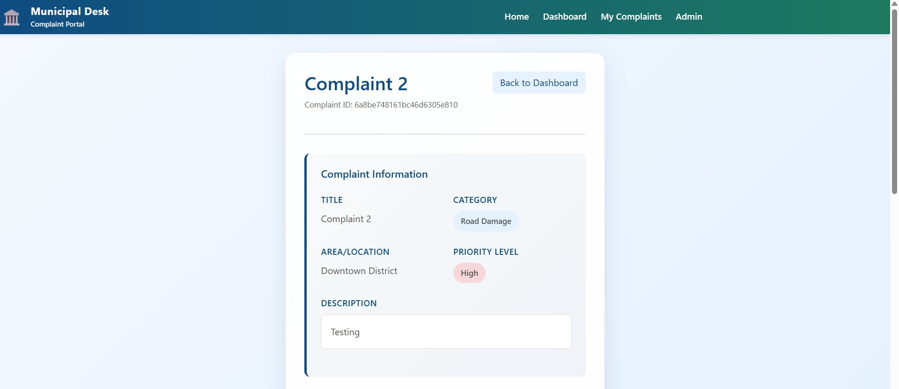
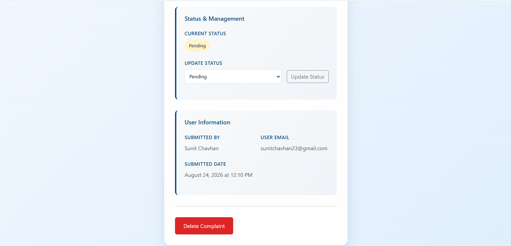
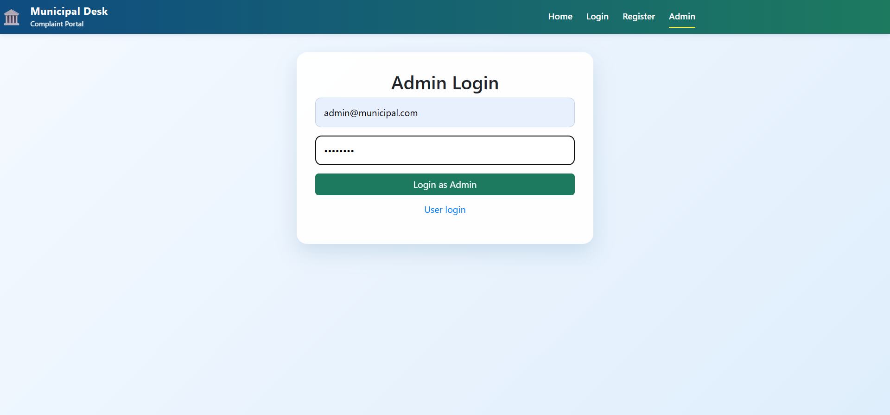
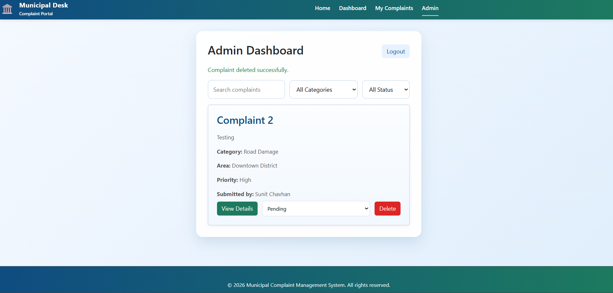

# Municipal Complaint Management System

A full-stack **Municipal Complaint Management System** built using the **MERN stack** for registering, managing, tracking, and resolving citizen complaints.

## Features

* User registration and login
* Submit and manage complaints
* Admin complaint management
* Complaint status tracking
* Complaint details and updates
* Citizen complaint management

## Technologies Used

**MongoDB, Express.js, React.js, Node.js and Bootstrap**

## Screenshots

### Home Page



### Login Page



### Registration Page



### Citizen Dashboard



### Complaint Creation



### Complaint Details



### Complaint Details - 2



### Admin Login



### Admin Dashboard



## Setup

### Backend

```bash
cd Backend
npm install
npm start
```

### Frontend

```bash
cd Frontend
npm install
npm run dev
```

Make sure **MongoDB** is running and the required environment variables are configured.

## Project Structure

```text
Municipal Complaint Management System/
│
├── Backend/
│   ├── models/
│   ├── routes/
│   ├── controllers/
│   └── package.json
│
├── Frontend/
│   ├── src/
│   ├── public/
│   └── package.json
│
├── Screenshots/
│   ├── admin-dashboard.png
│   ├── admin-login.png
│   ├── citizen-dashboard.png
│   ├── complaint-creation.png
│   ├── complaint-details-1.png
│   ├── complaint-details-2.png
│   ├── home-page.png
│   ├── login-page.png
│   └── register.png
│
└── README.md
```

## Default Admin Login

| Role  | Email                 | Password   |
| ----- | --------------------- | ---------- |
| Admin | `admin@municipal.com` | `admin123` |

## Project Objective

The objective of this project is to provide a digital platform for **citizens to submit complaints and for administrators to efficiently manage and track those complaints**.
